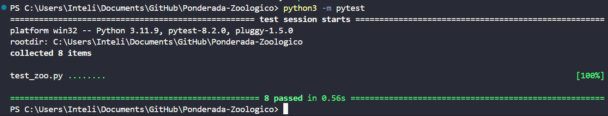

# Ponderada-Zoologico

## Autora: 

<a href="https://www.linkedin.com/in/anna-aragao/"> Anna Aragão </a>

## Sumário

- [Ponderada-Zoologico](#ponderada-zoologico)
  - [Autora:](#autora)
  - [Sumário](#sumário)
  - [1. Introdução](#1-introdução)
  - [2. Descrição das Classes](#2-descrição-das-classes)
  - [3. Descrição dos testes](#3-descrição-dos-testes)

## 1. Introdução 

&emsp;&emsp;Você foi contratado para criar a API que deve permitir aos jogadores realizar as seguintes operações: - Criação de Animais, tendo o mesmo nome, espécie e nível de felicidade. - Criação de Recintos para abrigar os animais, contendo um ou mais animais da mesma espécie, sendo estes bem ou mal cuidados. Pense em funções para alterar os recintos. - Alimentar os Animais, sendo que isso irá tornar os animais mais ou menos felizes. - Receber visitantes - Esta função irá permitir que os jogadores ganhem dinheiro com base no número de visitantes que o zoológico atrai. Visitantes são atraídos por animais felizes e recintos bem cuidados. Esta API deve ser desenvolvida utilizando a metodologia de desenvolvimento orientada a testes (TDD), realizando os respectivos testes unitários e testes de sistema finais da API.

## 2. Descrição das Classes

&emsp;&emsp;O código define três classes: Animal, Recinto, e Zoo, que juntas permitem simular um zoológico virtual. As principais funcionalidades de cada classe são:

1. Animal: 

Cada instância de Animal representa um animal no zoológico. Ele tem atributos como nome, espécie, nível de felicidade e estado de saciedade.

Os métodos alimentar() e passar_tempo() alteram o nível de felicidade do animal com base em se ele está saciado ou não.

O método feliz() verifica se o animal está feliz com base em seu nível de felicidade.

1. Recinto:

Um recinto abriga animais da mesma espécie.

Ele tem métodos para adicionar e remover animais, alimentar todos os animais no recinto, e determinar o número de visitantes atraídos com base na felicidade dos animais.

Também possui um método passar_tempo() que diminui a felicidade dos animais e marca o recinto como não bem cuidado.

1. Zoo:

O zoológico contém uma lista de recintos.

Possui métodos para criar recintos, alimentar animais em um recinto específico, receber visitantes, e passar o tempo, afetando a felicidade dos animais nos recintos.

## 3. Descrição dos testes

&emsp;&emsp;Para realizar os testes, digite python3 -m pytest

**Testes Unitários**

1. test_alimentar_aumenta_felicidade_quando_fome():

Testa se alimentar um animal aumenta sua felicidade quando está com fome.

2. test_alimentar_diminui_felicidade_quando_saciado():
   
Verifica se alimentar um animal diminui sua felicidade quando ele já está saciado.

3. test_receber_visitas_todos_felizes():
   
Testa se, ao receber visitas, todos os animais de um recinto ficam felizes. O cálculo parece ser relacionado ao nível médio de felicidade dos animais no recinto.

4. test_receber_visitas_alguns_felizes():

Similar ao anterior, mas aqui testa o caso em que apenas alguns animais ficam felizes ao receber visitas.

5. test_passar_tempo_afeta_felicidade_animais():

Verifica se passar o tempo afeta a felicidade dos animais no recinto, reduzindo-a. Aqui, o tempo passado é simulado e a felicidade dos animais é ajustada de acordo.

**Testes de Sistema**

1. test_criar_recinto():

Testa se é possível criar um recinto no zoológico e se ele é adicionado corretamente à lista de recintos do zoológico.

2. test_alimentar_animais():

Verifica se alimentar os animais em um recinto específico do zoológico afeta corretamente a felicidade deles.

3. test_passar_tempo():

Testa se passar o tempo no zoológico afeta corretamente a felicidade dos animais em cada recinto.

<h6 align="center"> Figura 1: Testes concluídos com sucesso </h6>

  

